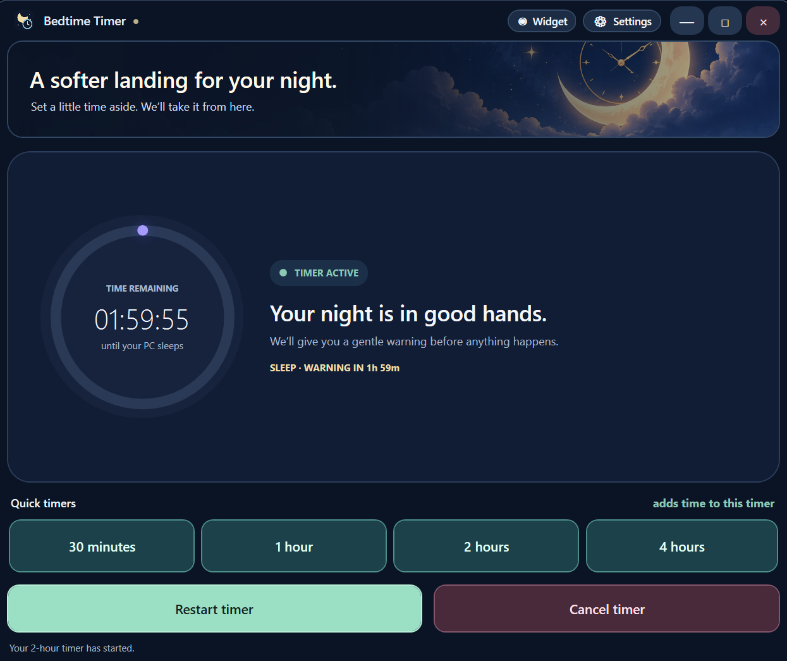
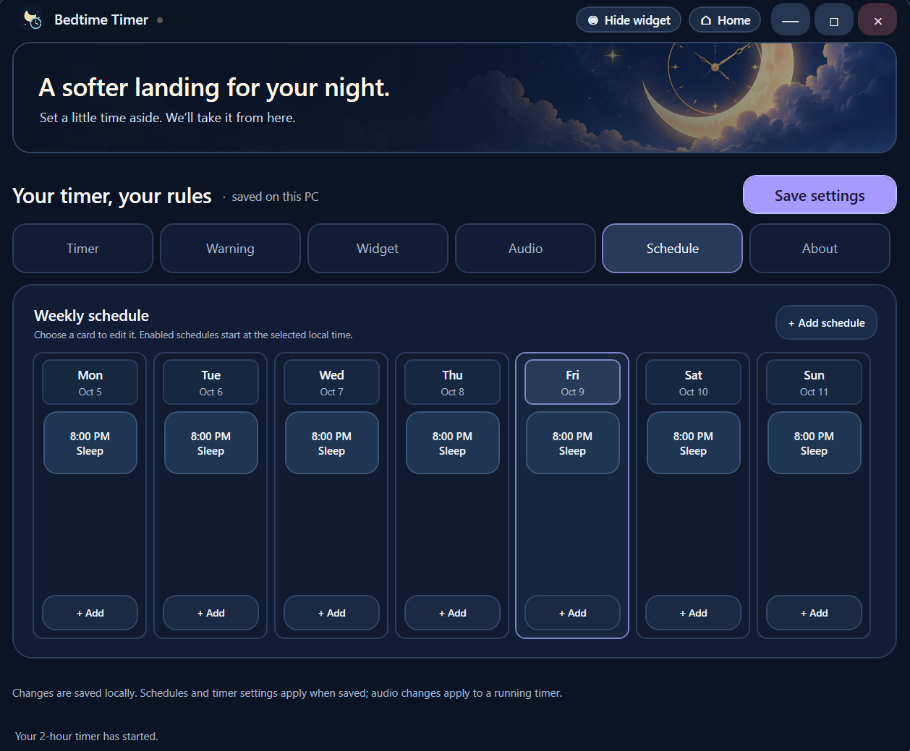
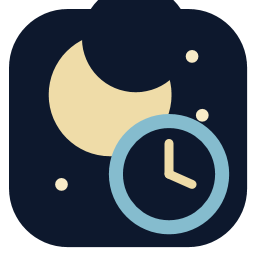

<div align="center">

# Bedtime Timer

**A calm, customizable countdown for Windows.**


[Download the latest release](https://github.com/Firefly3002/sleep-timer/releases/latest) · [GitHub source](https://github.com/Firefly3002/sleep-timer) · [More projects by Sparkfly](https://sparkfly.online/projects)

</div>

Bedtime Timer is a Windows desktop app for choosing what happens when a countdown ends. Use a quick preset or your saved timer, add time while it is running, and optionally play a soundtrack as you wind down.

## What it can do

- Start a saved countdown or choose a 30-minute, 1-hour, 2-hour, or 4-hour preset. Quick presets add time to an active countdown.
- Choose Sleep, Shut down, Restart, Lock, close an app gracefully, or launch a custom program when time is up.
- Show a configurable warning with snooze controls, or turn warnings off and run the selected action when the timer reaches zero.
- Play optional looping sleep music and a gentle cue when a warning opens or the timer ends. Choose built-in ambient, piano, rain, forest, ocean, and cue sounds, or use local audio files.
- Set recurring weekly countdowns in the Schedule tab. Choose local start times, repeat days, any supported power action, and whether to skip straight to the warning. Schedules use the saved timer length and warning/snooze settings; missed times and times that conflict with an active timer are skipped.
- Keep an optional draggable, resizable countdown widget on the desktop. Its moonlit background reflects timer progress.
- Open the app at Windows sign-in and choose whether the saved countdown also starts then.

## Screenshots

<p align="center">
  
</p>

<p align="center">
  
</p>

## App artwork

<p align="center">
  
  &nbsp;&nbsp;&nbsp;
  
</p>

The night-sky artwork and app icon are included in the application. The built-in sound sources and licenses are documented in [AUDIO-CREDITS.md](src/SleepTimer.App/Assets/Audio/AUDIO-CREDITS.md).

## Use

- Double-click **Bedtime Timer** on the desktop. It starts the saved timer immediately and shows the remaining time.
- The first run uses a two-hour timer, Sleep, a 60-second warning, a 15-minute snooze, and a full-screen warning.
- Open **Settings** to edit the saved duration, warning behavior, widget, audio, or About information.
- Open **Settings → Schedule** to add timers to individual days or repeat an entry on selected weekdays. Schedules run while Bedtime Timer is open or minimized to the tray; they do not run after you exit the app.
- For **Close an app**, choose from the refreshed list of open windows or enter a process name. Bedtime Timer sends a normal close request, waits up to 30 seconds, and never force-kills the app.
- A custom program uses a selected `.exe` and optional arguments, launched directly as your Windows account.
- During an active countdown, choose **Restart timer** to apply the saved duration and action. Choose **Cancel timer** in the app, widget, warning, or tray menu to stop it.
- The custom title bar's close button hides the app to the notification area. Choose **Exit** from the tray menu to close the app; it asks before stopping an active countdown.

Settings are stored locally and kept when you reinstall. The countdown runs only while the app is running.

See [CHANGELOG.md](CHANGELOG.md) for release history.

## Build

Build the Windows app with .NET 10:

```powershell
dotnet build SleepTimer.sln -c Release
```

Run the simulated timer checks with:

```powershell
dotnet run --project tests\SleepTimer.SimulatedTests\SleepTimer.SimulatedTests.csproj
```

To publish the self-contained app and create or update the desktop shortcut:

```powershell
pwsh -NoProfile -File tools\Publish.ps1
```

To create the Windows installer, install [Inno Setup 6 or 7](https://jrsoftware.org/isdl.php), then run:

```powershell
pwsh -NoProfile -File tools\Build-Installer.ps1
```

The installer is created at `dist\BedtimeTimerSetup.exe`. It installs for the current Windows user, creates desktop and Start menu shortcuts, and registers an uninstaller in Windows Settings. No .NET installation or administrator access is required. Uninstalling keeps saved settings so they are available if you reinstall later.

Original app-authored audio can be regenerated with `python tools\generate_sleep_audio.py`. The nature mixes can be regenerated with `python tools\mix_reference_audio.py` after placing the source MP3s in the ignored `tools\audio-source` folder. These scripts require Python 3; full audio regeneration also requires FFmpeg.

## About

Bedtime Timer is made by Sparkfly. Follow the project, browse the source, or report an issue on [GitHub](https://github.com/Firefly3002/sleep-timer). See [more projects on Sparkfly](https://sparkfly.online/projects).
